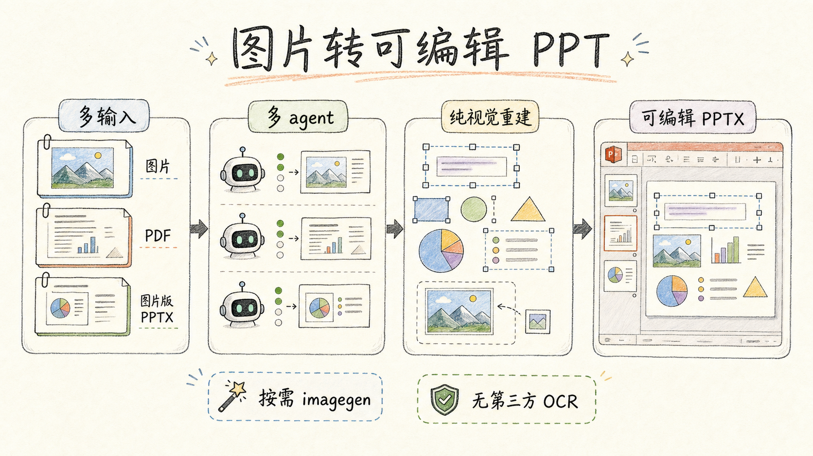
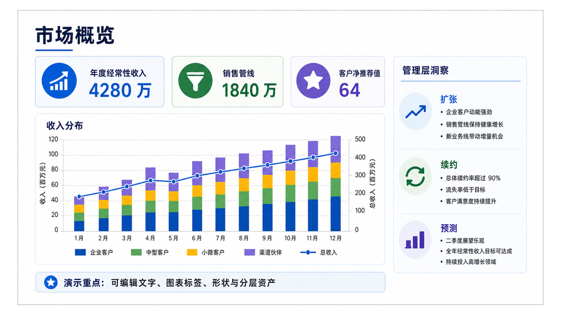
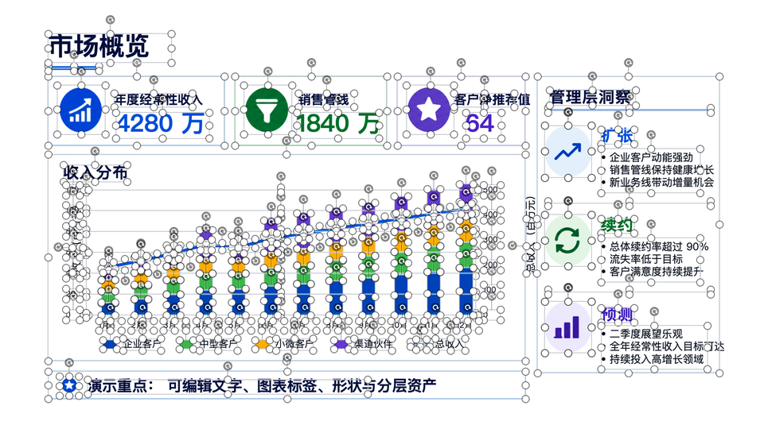
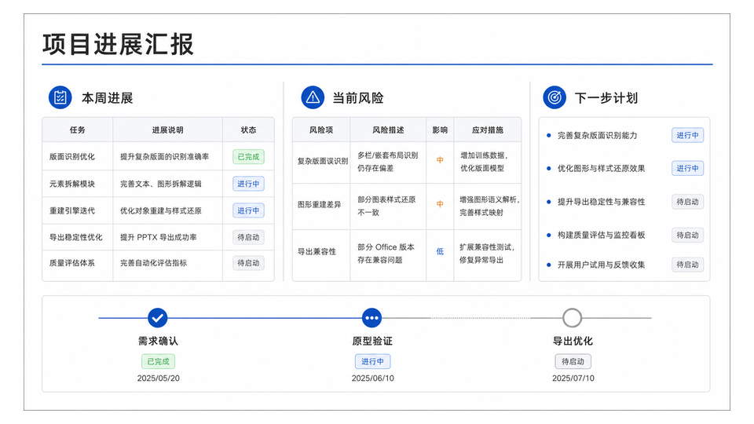
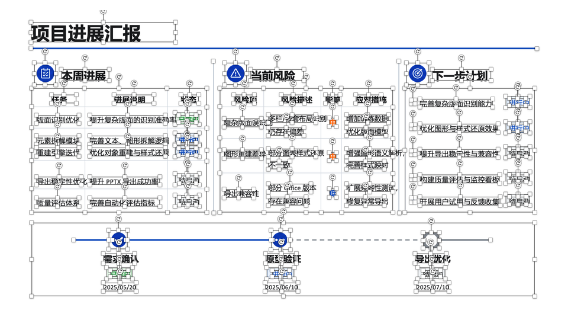
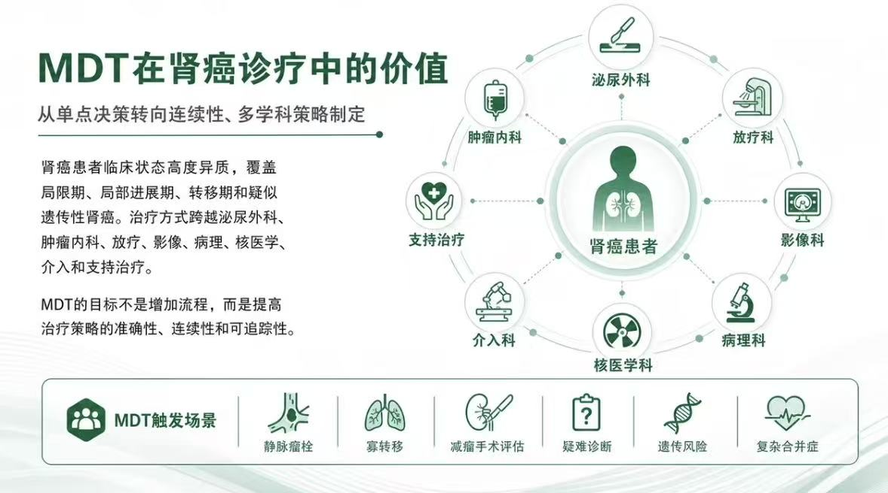
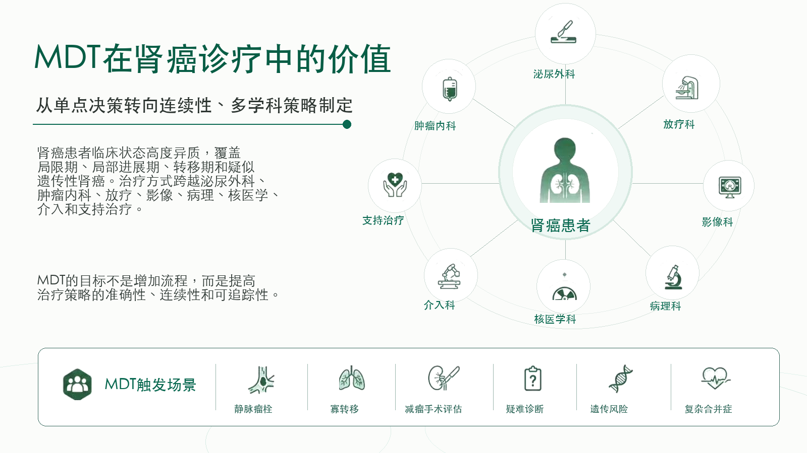

# Image to Editable PPT Skill

[](README.md) [](https://github.com/ningzimu/image-to-editable-ppt-skill/stargazers) [](https://github.com/ningzimu/image-to-editable-ppt-skill/forks)



A skill for converting images, PDFs, and image-based PPT files into editable PowerPoint `.pptx` output. It normalizes inputs into per-page jobs, then rebuilds editable text, simple shapes, and positioned visual assets.

It is useful when screenshot-like or image-based slides need to become easier to edit again, with text, simple shapes, and visual assets separated where practical.

> [!WARNING]
> This skill currently uses a multi-agent collaborative reconstruction workflow with complex flow control. It is not a lightweight converter. The AI runs a "**rebuild -> self-check -> page-local correction**" loop and may iterate multiple times until it judges the result close enough to the source. During this process, page workers may make **many attempts** per page, so the workflow can consume a large number of tokens.
>
> **GPT Pro is recommended. Plus users should use this skill cautiously.**
>
> Reconstructing a 10-page PPT may consume your entire 5-hour usage window. A single-page PPT reconstruction may take more than 10 minutes. Multi-page inputs are dispatched directly to page workers according to the configured concurrency slots.
>
> **If you do not strongly need editability, avoid this skill.**
>
> A lighter approach is to use gpt-image-2 image editing directly: provide the specific PPT page image you are unhappy with, ask for a targeted edit, and have it return the modified image.

> [!TIP]
> This skill does not create new decks from articles, reports, outlines, or ideas. If your goal is to generate a PPT, use [codex-ppt-skill](https://github.com/ningzimu/codex-ppt-skill).
>
> For a detailed introduction to `codex-ppt` and `image-to-editable-ppt`, see [skill_duo_intro.pdf](assets/skill_duo_intro.pdf). This deck was generated with the `codex-ppt` skill using the prompt: "请分别阅读 Codex PPT和 Image to Editable PPT 这两个技能的内容，然后用 Codex PPT 帮我做一个PPT吧，20页，每个技能的介绍10页。"
>
> For more practical notes on designing and tuning this editable PPT skill, see the Chinese article [2000 个 GitHub Star 换来的经验：好的 AI Skill 是调出来的，不是写出来的](https://mp.weixin.qq.com/s/LaxWBX-nogHPpSxlk-Vs8Q).

## Conversion Examples

<table>
  <tr>
    <th>Original</th>
    <th>Editable Result</th>
  </tr>
  <tr>
    <td></td>
    <td></td>
  </tr>
  <tr>
    <td></td>
    <td></td>
  </tr>
  <tr>
    <td></td>
    <td></td>
  </tr>
</table>

## Highlights

- Broad input coverage for many slide-reconstruction scenarios: one image, multiple images, multi-page PDFs, and image-based PPT files into editable `.pptx`.
- Every page — including single-image input — is dispatched by the main agent to page workers/subagents, in parallel according to `max_concurrent_pages`.
- Image generation and editing are unified through the `editppt image` CLI. The CLI uses local Codex OAuth first, then OpenAI-compatible API fallback when Codex auth is unavailable.
- Third-party API fallback configuration lives in `~/.editppt/config.yaml`; on Windows this is `%USERPROFILE%\.editppt\config.yaml`.
- Text sizes and positions are measurement-driven: prepare generates per-page text annotations (box coordinates + font sizes + size groups), and same-level text keeps one consistent size automatically.
- Keep multiple images in the provided order; preserve PDF and `.pptx` page order.
- Preserve `.pptx` speaker notes on matching output slides without modifying note text.
- Decides page by page whether to use the confirmed image backend for visual-layer extraction; when needed, sparse asset sheets group foreground assets to reduce image generation calls.
- Supports hybrid reconstruction: editable text, simple native shapes, and independent image assets.

## Use Cases

- Rebuild one or more slide images into a PowerPoint deck whose text and element positions can be adjusted.
- Convert multiple images or a multi-page PDF into a multi-slide `.pptx`.
- Convert image-based PPT slides into a more editable `.pptx` while preserving source speaker notes.
- Recreate a single-slide visual design while keeping text editable.
- Compare source pages against output slides to find missing text, alignment drift, or missing assets.

## Runtime Requirements

- Multi-page input requires the agent to dispatch page workers/subagents; if page workers cannot be created, run the skill in an environment that supports page workers.
- Complex background cleanup, foreground icon extraction, transparent asset sheets, and local image edits use `editppt image edit/generate/batch`.
- If local Codex OAuth exists (`~/.codex/auth.json`), the CLI uses it directly; otherwise it uses API fallback.
- API fallback configuration lives in `~/.editppt/config.yaml`; on Windows this is `%USERPROFILE%\.editppt\config.yaml`.
- Correcting text sizes and positions relies on a third-party OCR token (Baidu AI Studio, free) — see "Text Correction And OCR Token" below. Without it the skill falls back to the built-in offline detector with reduced text fidelity.

## Image Backend And Third-Party API Configuration

`editppt image` selects the image backend automatically: it uses local Codex OAuth first, then falls back to OpenAI-compatible API settings from `~/.editppt/config.yaml` or environment variables.

You usually do not need to configure this yourself. Ask the AI to configure API fallback only when:

- The user explicitly asks to use a third-party API or OpenAI-compatible proxy.
- The skill is used in Claude Code, OpenClaw, Hermes Agent, or another non-Codex environment without usable Codex OAuth auth.
- `editppt image` reports that both Codex OAuth and `OPENAI_API_KEY` are unavailable.

If third-party API fallback is needed, tell the AI which service, base URL, model name, and API key to use. While executing the skill, the AI handles environment checks and configuration, writes credentials to user-level config at `~/.editppt/config.yaml` (or `%USERPROFILE%\.editppt\config.yaml` on Windows), and masks sensitive values in output. Do not put API keys in the project, run, or skill directory.

## Text Correction And OCR Token (Recommended)

This skill uses a third-party OCR service (PaddleOCR-VL) to **correct text sizes and positions**: at the start of a conversion the whole input is submitted as one batch job, producing per-page text annotations (precise box coordinates, font sizes measured from source ink, size groups, and recognized text content). The AI reconstructs text from these measurements instead of visual guessing.

**The only thing you need to do is apply for a token**: get an Access Token at Baidu AI Studio: <https://aistudio.baidu.com/account/accessToken>. **For personal use the current free quota is more than enough — applying is risk-free with no extra cost.**

No manual commands are needed: the `editppt` CLI this skill relies on is **installed automatically by the AI while executing the skill**, and configuration is handled by the AI too. On first use, if no token is configured, the AI will ask you once — just paste the token you applied for, and the AI stores it in the user-level config (same file as the image API credentials, masked in output). Configure once and it works from then on, with no further prompts.

The skill still runs without a token: it falls back to the built-in offline detector (geometry only — it measures where text is and how large, but cannot read it), with reduced text fidelity.

## Known Limitations

- Other agents need skill loading, file access, CLI execution, and a page worker/subagent dispatch mechanism.
- Codex OAuth depends on the local Codex auth session and subscription-side image limits; API fallback depends on the selected OpenAI-compatible service's image generation/editing capabilities.
- This skill has relatively complex flow control and high token usage. The cost of converting an image-based PPT into an editable PPT **may be 2-3x the cost of generating an image-based PPT**.
- Results are limited by the model's baseline visual understanding and its ability to follow the skill workflow; usage quality is **not guaranteed for models below gpt-5.5**.
- Some image elements and text positions may shift slightly, so output is **not guaranteed to be a 100% replica of the original page**.

## Install

```text
Install the image-to-editable-ppt skill from https://github.com/ningzimu/image-to-editable-ppt-skill
```

After the skill is installed, normal conversion, image API fallback, and OCR token configuration are checked and handled by the AI while it executes the skill. You only need to provide third-party API details or an OCR token when the AI asks.

## Update

```text
Update the image-to-editable-ppt skill from https://github.com/ningzimu/image-to-editable-ppt-skill
```

## Usage

In agents that support explicit skill selection, use the agent's syntax to select `image-to-editable-ppt`; in Codex, use `$image-to-editable-ppt`. Images, PDFs, and `.pptx` files can be pasted or attached directly in the conversation, or provided as local paths:

```text
$image-to-editable-ppt convert this image into an editable PowerPoint.
$image-to-editable-ppt convert these images into one editable PowerPoint.
$image-to-editable-ppt convert <path-to-deck.pdf> into an editable PowerPoint.
$image-to-editable-ppt convert <path-to-image-based.pptx> into an editable PowerPoint.
```

The normal workflow is:

1. Create an isolated job folder, normalize inputs into `pages/page_NNN/source.png`, and write the default `editppt image` backend.
2. Dispatch every page — single-image input included — to page workers in `max_concurrent_pages` batches.
3. Each page worker owns one page directory and completes reconstruction, self-check, and page-local correction there.
4. Build one page manifest per page with editable text, simple shapes, and positioned image assets.
5. Use `editppt` commands to record dispatches, page results, and accepted status.
6. Use `editppt run finalize` to rebuild the final `.pptx` from recorded `manifest.json` files in page order, copy `.pptx` speaker notes when present, and run deck validation.

## Output Layout

Output is always a PowerPoint `.pptx` file:

| Input | Output |
| --- | --- |
| 1 image | 1-slide `.pptx` |
| Multiple images | Multi-slide `.pptx`, one slide per image, in the provided order |
| Multi-page PDF | Multi-slide `.pptx`; PDF page N maps to output slide N |
| Image-based PPT | `.pptx` with the same slide count; source slide N maps to output slide N |

Speaker notes are handled only for `.pptx` input. The parent agent copies notes to matching output slides unchanged: no translation, summarization, rewriting, or page-subagent processing.

Use one isolated output directory per conversion. All intermediate files and final outputs stay inside it:

```text
output/image-to-editable-ppt/{job-id}/        # One conversion job folder
├── input/                                    # Original input file copies
├── deck_manifest.json                        # Deck-level page list and output config
├── page_jobs.json                            # Per-page dispatch and completion state
├── run_state.json                            # Overall job state
├── notes_manifest.json                       # PPTX speaker-note extraction and mapping record
├── final/                                    # Final output folder
│   ├── {origin}_edited.pptx                  # Final editable PPTX
│   ├── validation.json                       # Final deck validation result
│   └── run_summary.json                      # Conversion summary
└── pages/                                    # Per-page reconstruction workspaces
    ├── page_001/                             # Page 1 workspace
    │   ├── source.png                        # Normalized source image for this page
    │   ├── page_request.json                 # Page request and image backend
    │   ├── worker-prompt.md                  # Prompt generated for the page worker in multi-page runs
    │   ├── imagegen-jobs.json                # Image generation/editing calls and result records for this page
    │   ├── assets/                           # Independent image assets for this page
    │   ├── page.pptx                         # Single-page PPTX used for record-time validation and deliverability checks
    │   ├── preview.png                       # Reconstructed page preview
    │   ├── split_assets_contact.png          # Asset-splitting inspection image
    │   ├── manifest.json                     # Text, shape, and asset description; authoritative input for finalize
    │   ├── validation.json                   # Page validation result
    │   └── page_result.json                  # Page artifact index
    └── page_002/                             # Later page workspace
        └── ...
```

## Scope

- This skill reconstructs input pages; it is not a from-scratch deck content generator.
- Multi-page input is rebuilt in parallel through page workers/subagents.
- Complex visual assets need an available `editppt image` backend; if image generation/editing is unavailable, still deliver the current openable, structurally valid PPT and describe missing assets in validation output.
- Complex photos, illustrations, textures, and hand-drawn decorations are usually movable image assets, not internally editable PowerPoint objects.
- Tables, charts, and diagrams should only be rebuilt as native objects when confidence is high enough; otherwise keep them as assets and document the limit.
- Visual similarity is not enough. Acceptance should check package structure, editable text coverage, asset provenance, preview, and diff.

## Repository Layout

```text
.
├── .github/                              # GitHub workflows and repository checks
├── skills/                               # Skill package directory
│   └── image-to-editable-ppt/            # Installable image-to-editable-ppt skill
│       ├── SKILL.md                      # Skill entrypoint and execution rules
│       ├── agents/                       # Skill metadata for agent UI
│       ├── cli/                          # Self-contained `editppt` CLI and deterministic runtime modules
│       ├── references/                   # Reconstruction, state-machine, and QA references
│       ├── prompts/                      # Page worker prompt templates
│       └── scripts/                      # Skill-local prompt builder scripts
├── AGENTS.md                             # Repository-level collaboration and editing rules
├── CHANGELOG.md                          # User-visible change log
├── LICENSE                               # Open-source license
├── README.md                             # Chinese documentation
└── README_en.md                          # English documentation
```

## Star History

[](https://www.star-history.com/#ningzimu/image-to-editable-ppt-skill&Date)

## Community

Scan the QR code to join the Skill community group, share usage experience, report issues, and receive update notices.


## License

MIT
