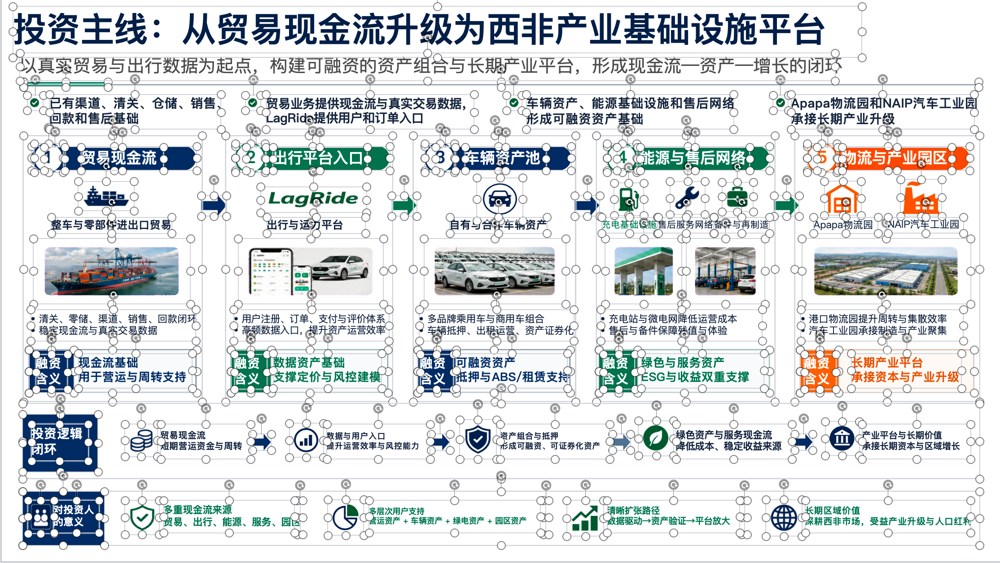

# Image to Editable PPT Skill

[简体中文](README.md) · [English](README_en.md) · **한국어**

[](https://ningzimu.github.io/image-to-editable-ppt-skill/#/ko/) [](https://github.com/ningzimu/image-to-editable-ppt-skill/stargazers) [](https://github.com/ningzimu/image-to-editable-ppt-skill/forks)


이미지, PDF, 이미지 기반 PPT를 편집 가능한 PowerPoint로 변환하는 skill입니다. 입력을 페이지별 작업으로 정규화한 다음 `.pptx`로 재구성합니다. 읽을 수 있는 텍스트는 가능한 한 네이티브 텍스트 상자로 복원하고, 단순한 도형은 PowerPoint 도형으로 복원하며, 복잡한 시각 요소는 출처가 기록된 독립 이미지 에셋으로 유지합니다.

스크린샷이나 이미지 형태의 슬라이드를 더 쉽게 다시 편집할 수 있는 PPT로 바꾸고, 텍스트·단순 도형·시각 에셋을 가능한 한 분리해 조정하려는 경우에 적합합니다.

> [!IMPORTANT]
> **Codex에서 이 skill을 실행할 때는 “전체 액세스 권한” 사용을 권장합니다.**
>
> 이 skill은 실행 시간이 길며 OCR, 이미지 생성/편집, 파일 읽기·쓰기, 하위 agent 분배, 장시간 폴링 등의 단계를 자동으로 수행합니다. “승인 요청” 모드는 실행을 자주 중단해 일부 단계를 막을 수 있으며, 특히 하위 agent 환경에서 문제가 될 수 있습니다.
>
> “대신 승인” 모드도 OCR 단계, ChatGPT 이미지 생성/편집 단계 또는 타사 API 호출 단계에서 요청을 차단하고 수동 승인을 요구할 수 있습니다. 사용자가 컴퓨터 앞에 없으면 변환 흐름이 멈출 수 있습니다.
>
> 변환 과정에서 바이두 PaddleOCR-VL API가 구성되어 있으면 페이지의 텍스트 상자, 글자 크기, 크기 그룹을 자동으로 보정합니다. 이미지 생성/편집은 Codex 내장 `image_gen.imagegen`을 우선 사용합니다. 내장 도구를 사용할 수 없거나 호출 오류가 발생하거나, 편집 입력을 읽을 수 없거나, 유효한 로컬 이미지를 반환하지 않은 경우에만 `editppt image`로 폴백합니다(Codex OAuth → OpenAI-compatible API). 이러한 호출은 이미지 기반 페이지를 편집 가능한 PPT로 재구성하는 데 필요한 단계입니다.
>
> 

> [!WARNING]
> 현재 이 skill은 멀티 agent 협업 복원 흐름과 복잡한 프로세스 제어를 사용하므로 가벼운 변환기가 아닙니다. AI는 “**재구성 → 자체 점검 → 페이지 내부 수정**” 사이클을 수행하며, 결과가 원본에 충분히 가깝다고 판단할 때까지 여러 번 반복할 수 있습니다. 이 과정에서 page worker가 한 페이지를 **여러 차례 시도**할 수 있어 전체 token 사용량이 큽니다.
>
> **ChatGPT Pro 사용자에게 권장하며, Plus 사용자는 신중하게 사용하세요.**
>
> 10페이지짜리 PPT 하나를 복원하는 데 5시간 한도를 모두 사용할 수도 있습니다. 한 페이지 또는 한 이미지의 복원에도 10분 이상 걸릴 수 있습니다. 단일 페이지/이미지 입력은 메인 agent가 동일한 페이지 재구성 흐름으로 로컬에서 처리할 수 있고, 다중 페이지 입력은 동시 실행 슬롯에 따라 page worker에게 분배됩니다.
>
> **편집 가능성이 꼭 필요하지 않다면 이 skill을 사용하지 마세요.**
>
> 더 가벼운 방법은 gpt-image-2의 이미지 편집 기능을 직접 사용하는 것입니다. 마음에 들지 않는 PPT 페이지 이미지를 보내고 필요한 부분만 수정한 이미지를 돌려받을 수 있습니다.

> [!TIP]
> 이 skill은 글, 보고서, 개요 또는 아이디어에서 새로운 PPT를 직접 만드는 용도가 아닙니다. “PPT 생성”이 목적이라면 [codex-ppt-skill](https://github.com/ningzimu/codex-ppt-skill)을 사용하세요.
>
> `codex-ppt`와 `image-to-editable-ppt` 두 skill에 대한 자세한 소개는 [skill_duo_intro.pdf](assets/skill_duo_intro.pdf)를 참고하세요. 이 PPT는 `codex-ppt` skill로 생성되었으며 프롬프트는 다음과 같습니다. “Codex PPT와 Image to Editable PPT 두 skill의 내용을 각각 읽고, Codex PPT로 20페이지짜리 PPT를 만들어 주세요. 각 skill 소개는 10페이지씩 구성해 주세요.”
>
> 이 편집 가능한 PPT Skill을 설계하고 조정한 경험은 다음 글에서도 확인할 수 있습니다. [2000 个 GitHub Star 换来的经验：好的 AI Skill 是调出来的，不是写出来的](https://mp.weixin.qq.com/s/LaxWBX-nogHPpSxlk-Vs8Q)

## 변환 결과 예시

<table>
  <tr>
    <th>원본 이미지</th>
    <th>변환 후 편집 가능한 결과</th>
  </tr>
  <tr>
    <td></td>
    <td></td>
  </tr>
  <tr>
    <td></td>
    <td></td>
  </tr>
  <tr>
    <td></td>
    <td></td>
  </tr>
  <tr>
    <td></td>
    <td></td>
  </tr>
</table>

## 특징

- 단일 이미지, 여러 이미지, 다중 페이지 PDF, 이미지 기반 PPT 등 다양한 입력을 편집 가능한 `.pptx`로 변환합니다.
- 단일 페이지/이미지 입력은 메인 agent가 동일한 페이지 재구성 흐름으로 로컬에서 처리할 수 있습니다. 다중 페이지 입력은 메인 agent가 page worker/subagent에게 분배하고 `max_concurrent_pages`에 따라 병렬 처리합니다.
- 이미지 생성과 편집은 Codex 내장 `image_gen.imagegen`을 우선 사용하며, 명확한 폴백 조건을 충족할 때만 `editppt image` CLI로 전환합니다. CLI는 로컬 Codex OAuth와 OpenAI-compatible API를 순서대로 선택합니다.
- 타사 API 폴백 설정은 `~/.editppt/config.yaml`에 저장됩니다. Windows에서는 `%USERPROFILE%\.editppt\config.yaml`을 사용합니다.
- 텍스트 크기와 위치는 측정값을 기반으로 합니다. prepare 단계에서 각 페이지의 텍스트 주석(상자 좌표 + 글자 크기 + 크기 그룹)을 생성하고, 모델은 이 측정값에 따라 텍스트를 복원하며 같은 계층의 텍스트 크기를 자동으로 일관되게 유지합니다.
- 여러 이미지는 제공된 순서대로 페이지를 생성하고, PDF와 `.pptx`는 원래 페이지 순서를 유지합니다.
- `.pptx` 입력의 페이지 노트는 내용 변경 없이 출력의 해당 페이지로 복사됩니다.
- 페이지 상황에 따라 확인된 image backend로 이미지 레이어를 분리할지 결정합니다. 필요한 경우 희소 asset sheet로 전경 소재를 모으며, 아이콘은 충분한 간격을 둔 하나의 소재 보드에 우선 배치해 후속 분리를 쉽게 합니다.
- 편집 가능한 텍스트 + 단순 도형 + 독립 이미지 에셋을 결합하는 복잡한 시각 페이지용 혼합 전략을 지원합니다.

## 사용 사례

- 하나 이상의 슬라이드 이미지를 텍스트와 요소 위치를 조정할 수 있는 PPT로 재구성합니다.
- 여러 이미지 또는 다중 페이지 PDF를 하나의 다중 페이지 `.pptx`로 변환합니다.
- 이미지 기반 PPT 페이지를 더 쉽게 편집할 수 있는 `.pptx`로 변환하면서 원본 페이지 노트를 유지합니다.
- 텍스트 편집 가능성을 유지하면서 한 페이지의 시각 디자인을 재현합니다.
- 원본 이미지와 출력 페이지를 비교해 누락된 텍스트, 위치 오류 또는 에셋 누락을 찾습니다.

## 실행 요구 사항

- 단일 페이지/이미지 입력은 page worker를 만들 필요가 없지만, 동일한 페이지 프롬프트·산출물·`editppt run record` 검증 흐름을 따라야 합니다. 다중 페이지 입력은 agent가 page worker/subagent를 분배할 수 있어야 하며, page worker를 만들 수 없다면 지원되는 환경에서 실행해야 합니다.
- 복잡한 배경 보완, 전경 아이콘 추출, 투명 asset sheet, 부분 이미지 편집은 페이지별로 순차 실행하며 내장 `image_gen.imagegen`을 우선 사용합니다.
- 내장 도구가 폴백 조건을 충족할 때만 CLI 폴백으로 전환합니다. 로컬에 Codex OAuth(`~/.codex/auth.json`)가 있으면 CLI가 직접 사용하고, 그렇지 않으면 API 폴백을 사용합니다.
- API 폴백 설정은 `~/.editppt/config.yaml`에 저장됩니다. Windows에서는 `%USERPROFILE%\.editppt\config.yaml`을 사용합니다.
- 텍스트 크기와 위치 보정에는 타사 OCR Token(바이두 AI Studio, 무료)이 필요합니다. 자세한 내용은 아래 “텍스트 보정 및 OCR Token”을 참고하세요. 설정하지 않으면 내장 오프라인 감지기로 폴백되어 텍스트 복원 품질이 낮아질 수 있습니다.

## 이미지 Backend 및 타사 API 구성

전체 backend 우선순위는 Codex 내장 `image_gen.imagegen` → Codex OAuth → OpenAI-compatible API입니다. 내장 도구는 agent가 직접 호출하며 Python/`editppt` CLI에서는 호출하거나 감지할 수 없습니다. 내장 도구를 사용할 수 없거나 호출할 수 없거나, 호출 오류가 발생하거나, 편집 입력을 읽을 수 없거나, 유효한 로컬 이미지를 반환하지 않은 경우에만 `editppt image` CLI 폴백으로 전환합니다. CLI는 먼저 로컬 Codex OAuth를 사용하고, 사용할 수 없으면 `~/.editppt/config.yaml` 또는 환경 변수의 OpenAI-compatible API 설정을 읽습니다.

내장 이미지 생성에는 `prompt`만 필요합니다. 내장 이미지 편집에는 `prompt`와 로컬 절대 경로인 `referenced_image_paths`만 필요하며 편집 전에 입력 이미지를 먼저 확인해야 합니다. 내장 도구에는 `mask`, `model`, `size`, `quality`, `out` 등의 매개변수가 없으며, 이러한 매개변수가 없다는 이유로 폴백하지 않습니다. 성공 후에는 도구가 명시적으로 반환한 로컬 경로(`output_hint` 포함)만 받아 파일 유효성을 확인한 뒤 가져옵니다. “최신 파일”을 추측하기 위해 디렉터리를 검색하지 않습니다.

CLI 폴백의 `editppt image generate/edit` 매개변수는 간결하게 유지됩니다. 요청 입력은 `--prompt` 또는 `--prompt-file`만 필요하고, 이미지 편집에는 `--image`도 필요합니다. 페이지 재구성 시에는 `--out`을 명시적으로 전달해야 합니다. 실용적인 제어 옵션은 `--model`, `--size`, `--quality`, `--force`, `--dry-run`, `--timeout`, 그리고 이미지 편집 전용 `--mask`뿐입니다. CLI는 다른 image API 옵션을 전달하지 않습니다.

일반적으로 직접 구성할 필요는 없습니다. 다음 경우에만 AI에게 API 폴백 구성을 요청하세요.

- 타사 API 또는 OpenAI 호환 중계 서비스를 사용하도록 명시적으로 요청한 경우
- Claude Code, OpenClaw, Hermes Agent 등 Codex가 아닌 환경에서 사용하며 Codex OAuth auth를 사용할 수 없는 경우
- `editppt image`가 Codex OAuth와 `OPENAI_API_KEY`를 모두 사용할 수 없다고 보고한 경우

타사 API 폴백이 필요하면 사용할 서비스, base URL, 모델명, API key를 AI에게 알려 주세요. AI가 실행 중 환경 확인과 설정 기록을 완료하고, 자격 증명을 사용자 수준 설정 `~/.editppt/config.yaml`(Windows에서는 `%USERPROFILE%\.editppt\config.yaml`)에 저장하며 출력에서는 민감한 값을 가립니다. API key를 프로젝트 디렉터리, run 디렉터리 또는 skill 디렉터리에 기록하지 마세요.

## 텍스트 보정 및 OCR Token(권장)

이 skill은 타사 OCR 서비스(PaddleOCR-VL)를 통해 **텍스트 크기와 위치를 보정**합니다. 변환이 시작되면 전체 입력을 하나의 일괄 작업으로 제출해 각 페이지의 텍스트 주석(정확한 상자 좌표, 원본 이미지의 실제 잉크 영역을 바탕으로 측정한 글자 크기, 같은 계층의 크기 그룹, 인식된 텍스트)을 생성합니다. AI는 재구성 시 이 측정값을 기준으로 삼으므로 더 이상 눈대중에 의존하지 않습니다.

**사용자가 할 일은 Token 신청 하나뿐입니다.** 바이두 AI Studio에서 Access Token을 신청하세요: <https://aistudio.baidu.com/account/accessToken>. **개인 사용의 경우 현재 무료 할당량으로 충분하며 추가 비용이 없습니다.**

명령을 직접 실행할 필요가 없습니다. 이 skill이 의존하는 `editppt` 명령줄 도구는 **AI가 skill 실행 과정에서 자동으로 설치**하며, 설정도 AI가 대신 처리합니다. 최초 사용 시 Token이 설정되어 있지 않으면 AI가 한 번 요청합니다. 신청한 Token을 전달하면 AI가 사용자 수준 설정(이미지 API 자격 증명과 같은 파일에 마스킹해 저장)에 기록하며, 한 번 구성하면 계속 적용되어 다시 묻지 않습니다.

Token 없이도 실행할 수 있습니다. 이 경우 skill은 내장 오프라인 감지기(텍스트 위치와 크기를 알지만 내용을 인식하지 않는 순수 기하 측정)로 폴백하므로 텍스트 복원 품질이 낮아질 수 있습니다.

## 알려진 문제

- 다른 agent는 skill 로딩, 파일 읽기·쓰기, CLI 실행을 지원해야 하며, 다중 페이지 작업에서는 page worker/subagent 분배도 지원해야 합니다.
- 내장 이미지 도구는 현재 agent runtime의 `image_gen.imagegen` 제공 여부에 의존합니다. Codex OAuth 경로는 로컬 Codex auth와 구독 측 이미지 할당량에 의존하고, API 폴백은 선택한 OpenAI-compatible 서비스의 이미지 생성/편집 기능에 의존합니다.
- 이 skill은 프로세스 제어가 비교적 복잡하고 Token 사용량이 큽니다. 이미지 PPT를 편집 가능한 PPT로 변환하는 비용은 **이미지 PPT 생성 비용의 2~3배**가 될 수 있습니다.
- 모델의 기본 이해 능력과 skill 준수 능력에 따라 **gpt-5.5 미만 모델의 사용 결과는 보장하지 않습니다.**
- 일부 이미지 요소와 텍스트 위치에 약간의 오차가 생길 수 있으며, **원본 페이지를 100% 재현한다고 보장하지 않습니다.**

## 설치

```text
image-to-editable-ppt skill을 설치해 주세요. 주소는 https://github.com/ningzimu/image-to-editable-ppt-skill 입니다.
```

skill 설치 후 일반 변환, 이미지 API 폴백, OCR Token 설정은 AI가 실행 중 확인하고 처리합니다. AI가 요청할 때 타사 API 정보나 OCR Token만 제공하면 됩니다.

## 업데이트

```text
image-to-editable-ppt skill을 업데이트해 주세요. 주소는 https://github.com/ningzimu/image-to-editable-ppt-skill 입니다.
```

## 사용 방법

skill을 명시적으로 선택할 수 있는 agent에서는 해당 문법으로 `image-to-editable-ppt`를 선택하세요. Codex에서는 `$image-to-editable-ppt`를 사용할 수 있습니다. 이미지, PDF, `.pptx`를 대화창에 직접 붙여 넣거나 첨부할 수 있고, 로컬 경로를 제공할 수도 있습니다.

```text
$image-to-editable-ppt 이 이미지를 편집 가능한 PPT로 변환해 주세요.
$image-to-editable-ppt 이 이미지들을 하나의 편집 가능한 PPT로 변환해 주세요.
$image-to-editable-ppt <path-to-deck.pdf>를 편집 가능한 PPT로 변환해 주세요.
$image-to-editable-ppt <path-to-image-based.pptx>를 편집 가능한 PPT로 변환해 주세요.
```

skill은 일반적으로 다음 단계를 수행합니다.

1. 독립 작업 디렉터리를 만들고 입력을 `pages/page_NNN/source.png`로 정규화한 뒤 기본 `editppt image` backend를 기록합니다.
2. 페이지가 하나뿐이면 메인 agent가 먼저 `editppt run dispatch --local`로 페이지를 맡은 뒤 동일한 페이지 프롬프트에 따라 로컬에서 재구성합니다. 페이지가 여러 개면 `max_concurrent_pages`에 따라 묶어 page worker에게 분배합니다.
3. 페이지 재구성 담당자(로컬 모드의 메인 agent 또는 page worker)는 자신의 페이지 디렉터리에서 페이지 재구성, 자체 점검, page-local 수정을 수행합니다.
4. 각 페이지에 manifest를 만들고 편집 가능한 텍스트, 단순 도형, 이미지 에셋을 재구성합니다.
5. `editppt` 명령으로 dispatch, page result, accepted 상태를 기록합니다.
6. 메인 agent가 `editppt run finalize`로 기록된 `manifest.json`을 페이지 순서대로 읽어 최종 `.pptx`를 재구성하고, `.pptx` 페이지 노트를 복사한 뒤 deck validation을 실행합니다.

## 출력 구조

출력은 항상 PowerPoint `.pptx`입니다.

| 입력 | 출력 |
| --- | --- |
| 이미지 1장 | 1페이지 `.pptx` |
| 여러 이미지 | 다중 페이지 `.pptx`, 이미지마다 1페이지, 제공된 순서대로 배치 |
| 다중 페이지 PDF | 다중 페이지 `.pptx`, PDF의 N번째 페이지가 출력의 N번째 페이지에 대응 |
| 이미지 기반 PPT | 같은 페이지 수의 `.pptx`, 원본 N번째 페이지가 출력 N번째 페이지에 대응 |

페이지 노트는 `.pptx` 입력에서만 처리합니다. 메인 agent가 원문 그대로 출력 PPTX의 해당 페이지로 복사하며, 번역·요약·수정하거나 page worker에게 넘기지 않습니다.

각 변환은 독립 출력 디렉터리를 사용하며 모든 중간 파일과 최종 결과를 그 안에 보관합니다.

```text
output/image-to-editable-ppt/{job-id}/        # 단일 변환 작업 디렉터리
├── input/                                    # 원본 입력 파일 사본
├── deck_manifest.json                        # 전체 deck의 페이지 목록과 출력 설정
├── page_jobs.json                            # 페이지별 분배 및 완료 상태
├── run_state.json                            # 현재 작업의 전체 실행 상태
├── notes_manifest.json                       # PPTX 페이지 노트 추출 및 매핑 기록
├── final/                                    # 최종 출력 디렉터리
│   ├── {origin}_edited.pptx                  # 최종 편집 가능 PPTX
│   ├── validation.json                       # 최종 deck 검증 결과
│   └── run_summary.json                      # 이번 변환 요약
└── pages/                                    # 페이지별 재구성 작업 공간
    ├── page_001/                             # 1페이지 작업 디렉터리
    │   ├── source.png                        # 정규화된 페이지 원본 이미지
    │   ├── page_request.json                 # 페이지 요청 및 image backend
    │   ├── worker-prompt.md                  # 페이지 재구성 담당자용 프롬프트
    │   ├── imagegen-jobs.json                # 이 페이지의 이미지 생성/편집 호출 및 결과 기록
    │   ├── assets/                           # 이 페이지에서 분리한 독립 이미지 에셋
    │   ├── page.pptx                         # 이 페이지의 단일 페이지 PPTX, record 단계의 검증 및 전달 가능성 확인용
    │   ├── preview.png                       # 이 페이지의 재구성 미리보기
    │   ├── split_assets_contact.png          # 이 페이지의 에셋 분리 확인 이미지
    │   ├── manifest.json                     # 페이지의 텍스트, 도형, 에셋 설명, finalize의 기준 입력
    │   ├── validation.json                   # 이 페이지의 검증 결과
    │   └── page_result.json                  # 이 페이지의 산출물 색인
    └── page_002/                             # 이후 페이지 작업 디렉터리
        └── ...
```

## 범위

- 이 skill은 입력 페이지를 편집 가능하게 재구성하는 용도이며, 처음부터 전체 PPT 콘텐츠를 생성하지 않습니다.
- 단일 페이지/이미지 입력은 메인 agent가 로컬에서 재구성할 수 있고, 다중 페이지 입력은 page worker/subagent가 병렬로 재구성합니다.
- 복잡한 시각 에셋에는 사용할 수 있는 내장 이미지 도구 또는 CLI 폴백이 필요합니다. 둘 다 규격에 맞는 에셋을 생성할 수 없으면 해당 페이지는 검증에 실패하며 근사 도형으로 대체하지 않습니다.
- 사진, 일러스트, 질감, 손그림 장식 등의 복잡한 시각 요소는 일반적으로 독립 이미지 에셋으로 이동할 수 있을 뿐, 내부 객체의 편집 가능성을 보장하지 않습니다.
- 표, 차트, 순서도 등의 구조화 영역은 편집 가능한 의미 구조를 우선 보존하지만, 신뢰도가 낮으면 에셋으로 유지하고 검증 보고서에 설명합니다.
- 시각적으로 비슷하다는 것이 편집 가능하다는 뜻은 아닙니다. 최종 판단 시 PPTX 구조, 텍스트 커버리지, 에셋 출처, 미리보기/diff를 함께 확인해야 합니다.

## 저장소 구조

```text
.
├── .github/                              # GitHub 워크플로 및 저장소 검사 설정
├── skills/                               # Skill 설치 패키지 디렉터리
│   └── image-to-editable-ppt/            # 설치 가능한 image-to-editable-ppt skill
│       ├── SKILL.md                      # skill 진입점 설명 및 실행 규칙
│       ├── agents/                       # Agent 표시용 skill 메타데이터
│       ├── cli/                          # 자체 포함 `editppt` CLI 및 결정적 runtime 모듈
│       ├── references/                   # 페이지 재구성, 상태 머신, QA 등의 참조 규격
│       ├── prompts/                      # 페이지 재구성 프롬프트 템플릿
│       └── scripts/                      # skill 내부 프롬프트 조립 스크립트
├── AGENTS.md                             # 저장소 수준 협업 및 편집 규칙
├── CHANGELOG.md                          # 사용자에게 보이는 변경 기록
├── LICENSE                               # 오픈 소스 라이선스
├── README.md                             # 중국어 설명 문서
├── README_en.md                          # 영어 설명 문서
└── README_ko.md                          # 한국어 설명 문서
```

## 커뮤니티

QR 코드를 스캔해 Skill 커뮤니티에 참여하고 사용 경험과 피드백을 공유하며 업데이트 알림을 받아 보세요.


## 라이선스

MIT
